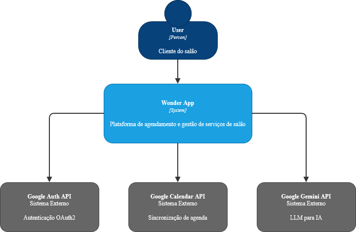
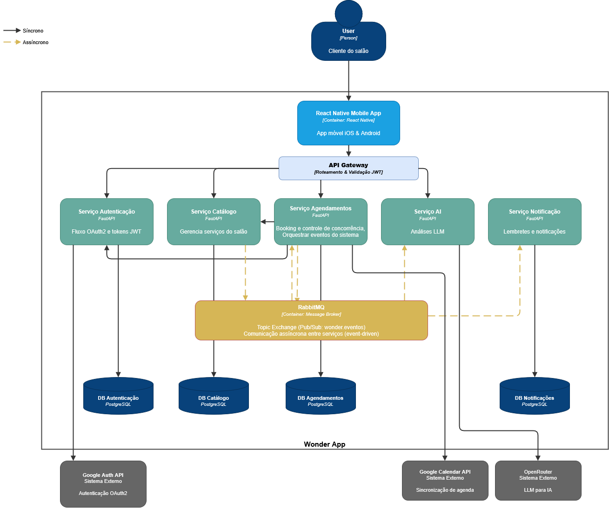

# Arquitetura

O Wonder App é construído como um **ecossistema de microsserviços**, orquestrado via Docker Compose, com comunicação síncrona (REST, via API Gateway) e assíncrona (eventos via RabbitMQ) entre os serviços.

## Diagrama de Contexto (C4 — Nível 1)

O sistema Wonder interage com um único ator humano direto neste nível — o **Cliente do salão** — e com três sistemas externos:

- **Google Auth API** — autenticação OAuth2.
- **Google Calendar API** — sincronização de agenda.
- **Google Gemini API** — motor de LLM para o assistente de IA.

## Diagrama de Container (C4 — Nível 2)

O container principal do Wonder App é composto pelos seguintes elementos:

| Container | Tecnologia | Responsabilidade |
|---|---|---|
| **React Native Mobile App** | React Native (Expo) | Interface móvel iOS & Android consumida pelo cliente |
| **API Gateway** | FastAPI | Ponto único de entrada, roteamento e validação de JWT |
| **Serviço de Autenticação** | FastAPI + PostgreSQL | Fluxo OAuth2 e emissão de tokens JWT |
| **Serviço de Catálogo** | FastAPI + PostgreSQL | Gerencia prestadores, serviços, horários e avaliações |
| **Serviço de Agendamentos** | FastAPI + PostgreSQL | Booking, controle de concorrência e orquestração de eventos do sistema |
| **Serviço de IA** | FastAPI | Análises via LLM (Google Gemini, através do OpenRouter) |
| **Serviço de Notificação** | FastAPI + PostgreSQL | Consome eventos e gera lembretes/notificações |
| **RabbitMQ** | Message Broker | Topic Exchange (`wonder.eventos`) para comunicação assíncrona *event-driven* entre serviços |

### Justificativa das decisões arquiteturais

**Banco de dados isolado por serviço.** Cada microsserviço com estado próprio (Autenticação, Catálogo, Agendamentos, Notificação) possui seu próprio banco PostgreSQL. Essa decisão reforça o desacoplamento entre serviços — nenhum serviço acessa diretamente a tabela de outro — ao custo de exigir um serviço agregador (Admin) para visões unificadas de auditoria e monitoramento.

**API Gateway como ponto único de entrada.** Centraliza a validação de JWT e o roteamento, evitando que cada microsserviço reimplemente lógica de autenticação — os serviços internos confiam nos headers injetados pelo Gateway (`X-User-ID`, `X-User-Role`).

**RabbitMQ para comunicação assíncrona.** Fluxos que não precisam de resposta imediata ao cliente (ex.: notificar sobre um agendamento criado ou cancelado) são desacoplados via fila. Isso garante que uma eventual indisponibilidade do serviço de Notificação não impacte o fluxo principal de Agendamentos — a operação é persistida no banco normalmente e o erro de publicação é apenas logado.

**Serviço de IA isolado.** Mantém a chamada ao provedor externo de LLM (Gemini via OpenRouter) separada da lógica de negócio de Agendamentos, ainda que dependa de uma chamada HTTP interna ao serviço de Agendamentos para montar o histórico do usuário — um exemplo de comunicação síncrona *service-to-service* dentro da rede Docker interna.

### Descrição de cada microsserviço

- **Auth:** cadastro/login via Google OAuth2, emissão de JWT, gerenciamento de usuários e papéis (`cliente`, `prestador`, `admin`).
- **Catálogo:** CRUD de prestadores, categorias, serviços, horários de funcionamento e avaliações.
- **Agendamentos:** criação/cancelamento de agendamentos com controle de conflito de horário, e publicação de eventos no RabbitMQ.
- **Notificação:** consumidor de eventos do RabbitMQ, responsável por gerar e listar notificações para o usuário.
- **IA:** endpoint de sugestões e chat, integrando com o modelo LLM externo.
- **Admin** *(container de apoio, não representado no C4 acima)*: agrega relatórios de auditoria e métricas de monitoramento consultando os quatro bancos isoladamente.
- **Backup** *(container de apoio)*: executa `pg_dump` agendado nos quatro bancos.

Veja também: [[Diagramas]] para o diagrama de casos de uso e o diagrama de classes, e [[Auditoria, Monitoramento e Backup]] para detalhes de operação em produção.
