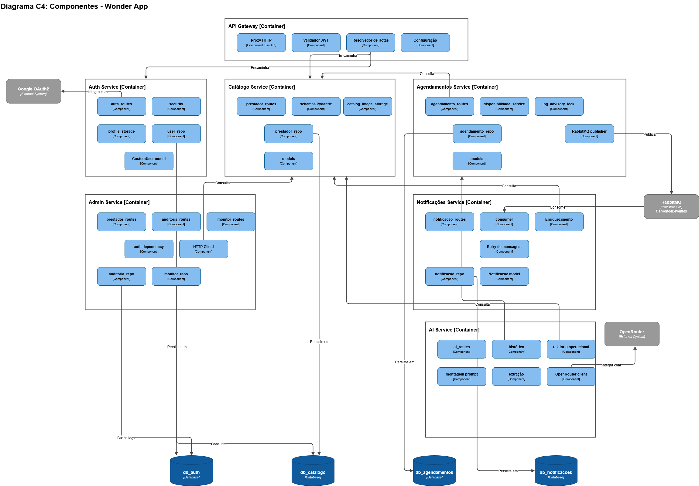

# C4 — Nível 3: Componentes

O diagrama de Componentes detalha os módulos internos de cada microsserviço e como eles se relacionam entre si, com o Gateway, com o RabbitMQ e com os bancos de dados.

## API Gateway

Componentes: `Proxy HTTP` (FastAPI), `Validador JWT`, `Resolvedor de Rotas`, `Configuração`. Encaminha requisições para Auth, Catálogo e Agendamentos (e, por roteamento, para os demais serviços).

## Auth Service

Componentes: `auth_routes`, `security`, `profile_storage`, `user_repo`, `CustomUser model`. Integra com **Google OAuth2**. Persiste em `db_auth`.

## Catálogo Service

Componentes: `prestador_routes`, `schemas Pydantic`, `catalog_image_storage`, `prestador_repo`, `models`. Persiste em `db_catalogo`.

## Agendamentos Service

Componentes: `agendamento_routes`, `disponibilidade_service`, `pg_advisory_lock`, `agendamento_repo`, `models`, `RabbitMQ publisher`. Consulta o Catálogo Service; publica eventos no RabbitMQ; persiste em `db_agendamentos`.

## Notificações Service

Componentes: `notificacao_routes`, `consumer`, `Enriquecimento`, `Retry de mensagem`, `notificacao_repo`, `Notificacao model`. Consome eventos do RabbitMQ; persiste em `db_notificacoes`.

## AI Service

Componentes: `ai_routes`, `histórico`, `relatório operacional`, `montagem prompt`, `extração`, `OpenRouter client`. Consulta o Agendamentos Service para histórico; integra com **OpenRouter**.

## Admin Service

Componentes: `prestador_routes`, `auditoria_routes`, `monitor_routes`, `auth dependency`, `HTTP Client`, `auditoria_repo`, `monitor_repo`. Consulta Auth e Catálogo via HTTP Client; busca logs em `db_auth` e `db_catalogo`.

## Atualização confirmada em código (ainda não desenhada)

O commit [`e687be7`](https://github.com/llwkascarvalho/wonder-app/commit/e687be722e6108a73bc554175631172b95c01768) introduziu duas dependências que ainda não aparecem neste diagrama:

1. **AI Service → Catálogo Service** — nova variável `CATALOGO_SERVICE_URL` em `services/ai/src/main/core/config.py`, usada para resolver dados de serviços em relatórios/sugestões.
2. **Agendamentos Service → Catálogo Service** — função `buscar_duracao_servico()` em `agendamento_repo.py`, chamada HTTP síncrona para obter a duração do serviço e calcular a conclusão automática do agendamento (duração + 60 minutos).

**Ação sugerida:** adicionar uma seta "Consulta" partindo de `ai_routes`/`relatório operacional` para `prestador_repo` (Catálogo), e confirmar/reforçar a seta já existente entre `agendamento_repo` e o Catálogo Service, rotulando-a como "Consulta duração do serviço".

Para o modelo de dados persistido por cada serviço, veja [Modelo Lógico](Modelo-Logico) e [Diagrama de Classes](Diagrama-de-Classes).
