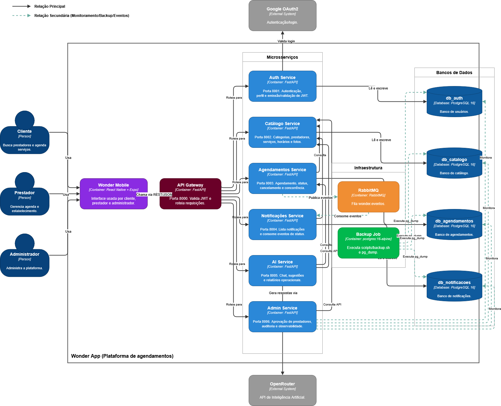

# C4 — Nível 2: Container

O diagrama de Container detalha o Wonder App em containers implantáveis: o app mobile, o gateway, os seis microsserviços, a infraestrutura de mensageria/backup e os quatro bancos de dados isolados.

## Containers

| Container | Tecnologia | Porta | Responsabilidade |
|---|---|---|---|
| Wonder Mobile | React Native + Expo | — | Interface usada por cliente, prestador e administrador |
| API Gateway | FastAPI | 8000 | Valida JWT e roteia requisições |
| Auth Service | FastAPI | 8001 | Autenticação, perfil e emissão/validação de JWT |
| Catálogo Service | FastAPI | 8002 | Categorias, prestadores, serviços, horários e fotos |
| Agendamentos Service | FastAPI | 8003 | Agendamento, status, cancelamento e concorrência |
| Notificações Service | FastAPI | 8004 | Lista notificações e consome eventos de status |
| AI Service | FastAPI | 8005 | Chat, sugestões e relatórios operacionais |
| Admin Service | FastAPI | 8006 | Aprovação de prestadores, auditoria e observabilidade |
| RabbitMQ | RabbitMQ | — | Fila `wonder.eventos` |
| Backup Job | postgres:16-alpine | — | Executa `scripts/backup.sh` e `pg_dump` |

## Bancos de dados

| Banco | Conteúdo |
|---|---|
| `db_auth` | Usuários |
| `db_catalogo` | Catálogo (prestadores, categorias, serviços, horários) |
| `db_agendamentos` | Agendamentos e histórico |
| `db_notificacoes` | Notificações |

O **Admin Service não possui banco próprio** — ele consulta os endpoints de auditoria/monitoramento dos demais serviços para consolidar observabilidade.

## Relações principais

- Cliente, Prestador e Administrador usam o **Wonder Mobile**, que chama o **API Gateway** via REST/JSON.
- O Gateway roteia para cada um dos seis microsserviços.
- **Auth Service** valida login junto ao **Google OAuth2**.
- **AI Service** gera respostas via **OpenRouter**.
- **Agendamentos**, **Notificações** e **Admin** publicam/consomem eventos via **RabbitMQ**.
- O **Backup Job** executa `pg_dump` nos quatro bancos e é monitorado pelo Admin Service (relação secundária, tracejada no diagrama).

## Atualização confirmada em código

O commit [`e687be7`](https://github.com/llwkascarvalho/wonder-app/commit/e687be722e6108a73bc554175631172b95c01768) adicionou uma chamada HTTP direta do **AI Service** ao **Catálogo Service** (variável `CATALOGO_SERVICE_URL`), e do **Agendamentos Service** ao **Catálogo Service** (função `buscar_duracao_servico`), usadas para resolver a duração de serviços em relatórios e na conclusão automática de agendamentos. Recomenda-se adicionar essas duas setas "Consulta" ao diagrama.

Para o detalhamento interno de cada container, veja [C4 — Componentes](C4-Componentes).
