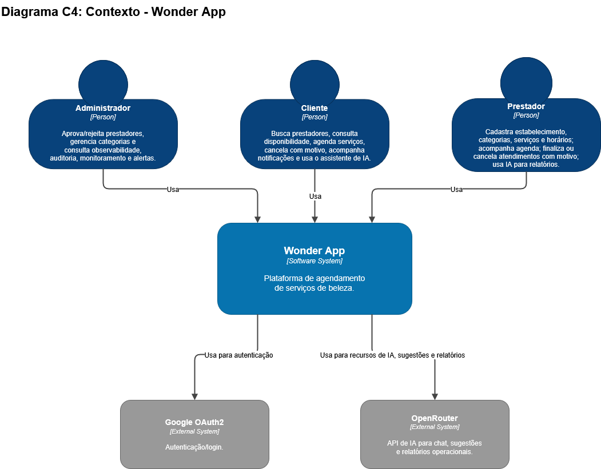

# C4 — Nível 1: Contexto

O diagrama de Contexto mostra o Wonder App como uma caixa única, seus três atores humanos e os dois sistemas externos com que ele se integra.

## Atores

| Ator | O que faz |
|---|---|
| **Cliente** | Busca prestadores, consulta disponibilidade, agenda serviços, cancela com motivo, acompanha notificações e usa o assistente de IA |
| **Prestador** | Cadastra estabelecimento, categorias, serviços e horários; acompanha agenda; finaliza ou cancela atendimentos com motivo; usa IA para relatórios |
| **Administrador** | Aprova/rejeita prestadores, gerencia categorias e consulta observabilidade, auditoria, monitoramento e alertas |

## Sistema

**Wonder App** — plataforma de agendamento de serviços de beleza.

## Sistemas externos

| Sistema | Uso |
|---|---|
| **Google OAuth2** | Autenticação/login |
| **OpenRouter** | API de IA para chat, sugestões e relatórios operacionais |

Este é o nível mais abstrato do modelo C4. Para o detalhamento em containers (serviços, banco de dados, mensageria), veja [C4 — Container](C4-Container).
