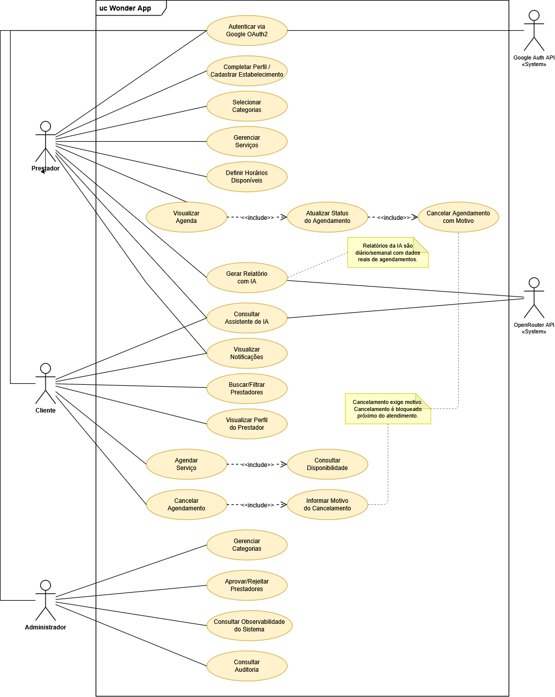

# Casos de Uso

Diagrama de casos de uso do Wonder App, organizado pelos três atores humanos e os dois sistemas externos.

## Prestador

- Autenticar via Google OAuth2
- Completar Perfil / Cadastrar Estabelecimento
- Selecionar Categorias
- Gerenciar Serviços
- Definir Horários Disponíveis
- Visualizar Agenda → **inclui** Atualizar Status do Agendamento → **inclui** Cancelar Agendamento com Motivo
- Gerar Relatório com IA (consulta OpenRouter API; relatórios são diário/semanal, com dados reais de agendamentos)
- Consultar Assistente de IA

## Cliente

- Autenticar via Google OAuth2
- Consultar Assistente de IA (consulta OpenRouter API)
- Visualizar Notificações
- Buscar/Filtrar Prestadores
- Visualizar Perfil do Prestador
- Agendar Serviço → **inclui** Consultar Disponibilidade
- Cancelar Agendamento → **inclui** Informar Motivo do Cancelamento

## Administrador

- Gerenciar Categorias
- Aprovar/Rejeitar Prestadores
- Consultar Observabilidade do Sistema
- Consultar Auditoria

## Sistemas externos

- **Google Auth API** — autentica Prestador e Cliente.
- **OpenRouter API** — atende os casos de uso "Gerar Relatório com IA" e "Consultar Assistente de IA".

## Regras destacadas no diagrama

- Cancelamento exige motivo e é bloqueado próximo do atendimento (nota associada aos casos "Cancelar Agendamento" e "Cancelar Agendamento com Motivo").
- Relatórios da IA são diário/semanal, com dados reais de agendamentos (nota associada ao caso "Gerar Relatório com IA").

## Rastreabilidade com requisitos

| Caso de uso | Requisito |
|---|---|
| Autenticar via Google OAuth2 | RF001 |
| Buscar/Filtrar Prestadores | RF002 |
| Agendar Serviço / Consultar Disponibilidade | RF003 |
| Consultar Assistente de IA | RF004 |
| Cancelar Agendamento / Informar Motivo | RF005 |
| Visualizar Notificações | RF006 |
| Completar Perfil / Cadastrar Estabelecimento | RF007 |
| Gerenciar Serviços | RF008 |
| Definir Horários Disponíveis | RF009 |
| Atualizar Status do Agendamento / Cancelar com Motivo | RF010 |
| Gerenciar Categorias / Aprovar-Rejeitar Prestadores | RF011 |
| Consultar Auditoria | RF011\* |
| Consultar Observabilidade do Sistema | RF012 |

Veja o detalhamento funcional correspondente em [Visão Funcional](Visao-Funcional).
