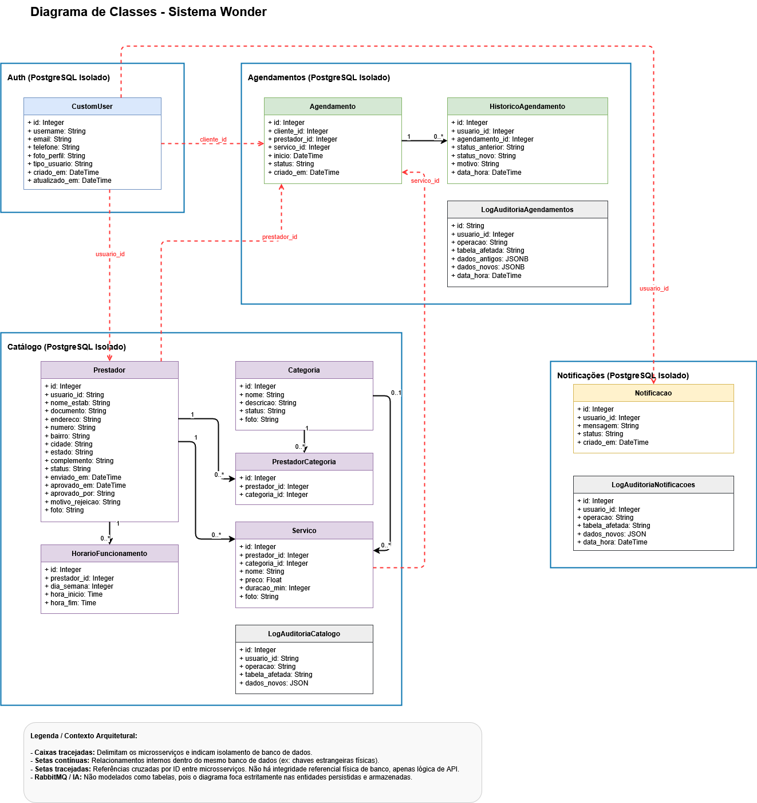

# Diagrama de Classes

Diagrama de classes do Wonder App, organizado por microsserviço. Cada retângulo tracejado delimita um banco PostgreSQL isolado; setas contínuas são relacionamentos internos ao mesmo banco (FK física), setas tracejadas vermelhas são referências cruzadas por ID entre microsserviços (sem integridade referencial física).

## Auth (PostgreSQL isolado)

- **CustomUser**: id, username, email, telefone, foto_perfil, tipo_usuario, criado_em, atualizado_em.

## Catálogo (PostgreSQL isolado)

- **Prestador**: dados do estabelecimento, endereço, status de aprovação (`status`, `aprovado_em`, `aprovado_por`, `motivo_rejeicao`). Referencia `CustomUser.id` via `usuario_id` (lógico).
- **Categoria**: nome, descrição, status, foto.
- **PrestadorCategoria**: associativa N:N entre Prestador e Categoria.
- **Servico**: nome, preço, duração, foto. Pertence a um Prestador e opcionalmente a uma Categoria.
- **HorarioFuncionamento**: dia da semana, hora_inicio, hora_fim, associado a um Prestador.
- **LogAuditoriaCatalogo**: log de auditoria do banco.

## Agendamentos (PostgreSQL isolado)

- **Agendamento**: cliente_id, prestador_id, servico_id (todos referências lógicas ao Catálogo/Auth), início, status, criado_em.
- **HistoricoAgendamento**: histórico de mudanças de status por agendamento, com motivo.
- **LogAuditoriaAgendamentos**: log de auditoria do banco.

## Notificações (PostgreSQL isolado)

- **Notificacao**: usuario_id (referência lógica), mensagem, status, criado_em.
- **LogAuditoriaNotificacoes**: log de auditoria do banco.

## Convenções do diagrama

- **Caixas tracejadas** delimitam os microsserviços e indicam isolamento de banco de dados.
- **Setas contínuas** representam relacionamentos internos, dentro do mesmo banco (chaves estrangeiras físicas).
- **Setas tracejadas** representam referências cruzadas por ID entre microsserviços — apenas lógica de API, sem FK física.
- RabbitMQ e IA não são modelados como classes, pois o diagrama foca estritamente nas entidades persistidas.

Este desacoplamento de bancos é o que garante que cada microsserviço evolua e escale de forma independente — ponto reforçado no [Modelo Lógico](Modelo-Logico) e nas lições aprendidas do [Processo de Software](Processo-de-Software) (Sprint 7: "conexões simultâneas aos quatro bancos isolados exigiu atenção especial ao isolamento de cada microsserviço").
