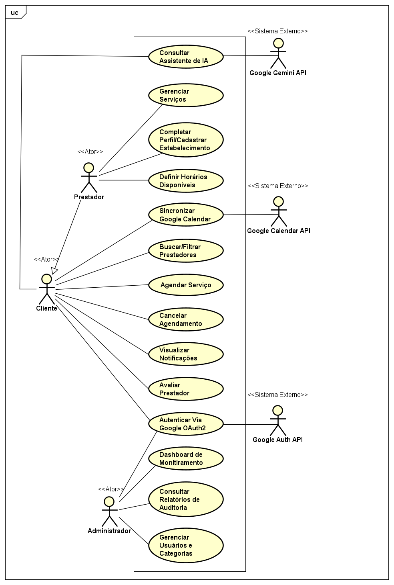
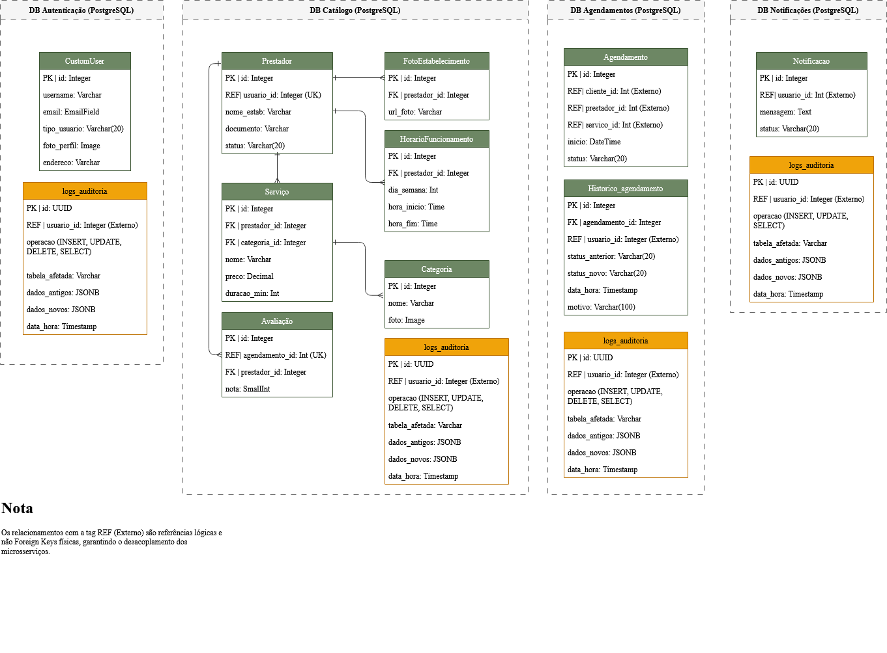

# Diagramas

Esta página reúne o diagrama de casos de uso e o diagrama de classes do Wonder App, complementando os diagramas C4 apresentados em [[Arquitetura]].

## Diagrama de Casos de Uso

O diagrama mapeia as ações de cada ator do sistema:

- **Cliente:** Buscar/Filtrar Prestadores, Agendar Serviço, Cancelar Agendamento, Visualizar Notificações, Avaliar Prestador, Autenticar via Google OAuth2 e Consultar Assistente de IA.
- **Prestador:** herda as ações de Cliente e adiciona Completar Perfil/Cadastrar Estabelecimento, Gerenciar Serviços, Definir Horários Disponíveis e Sincronizar Google Calendar.
- **Administrador:** Dashboard de Monitoramento, Consultar Relatórios de Auditoria e Gerenciar Usuários e Categorias.
- **Sistemas externos:** Google Gemini API (Consultar Assistente de IA), Google Calendar API (Sincronizar Google Calendar) e Google Auth API (Autenticar via Google OAuth2) participam como atores externos vinculados aos respectivos casos de uso.

A relação de herança entre **Prestador** e **Cliente** no diagrama reflete uma decisão de modelagem: todo prestador também pode agir como cliente dentro do mesmo aplicativo (por exemplo, agendando serviços em outro salão), reaproveitando o mesmo conjunto de casos de uso base.

## Modelo Lógico de Dados / Diagrama de Classes

O diagrama de classes do Wonder App é derivado diretamente do modelo lógico do banco de dados, já que cada modelo ORM (`models/*.py`) corresponde a uma tabela em um dos quatro bancos isolados por serviço.

### Estrutura por serviço

**DB Autenticação**
- `CustomUser`: dados do usuário (username, email, tipo_usuario, foto_perfil, endereço).
- `logs_auditoria`: trilha de auditoria (INSERT/UPDATE/DELETE/SELECT) das tabelas deste banco.

**DB Catálogo**
- `Prestador`: dados do estabelecimento, referenciando o `usuario_id` do serviço de Auth de forma lógica (não FK física).
- `Servico`: serviços oferecidos por um prestador, vinculado a uma `Categoria`.
- `HorarioFuncionamento`: horários de atendimento do prestador.
- `Avaliacao`: avaliação de um prestador, vinculada a um `agendamento_id` (referência lógica ao serviço de Agendamentos).
- `FotoEstabelecimento`: fotos associadas ao prestador.
- `Categoria`: taxonomia dos tipos de serviço.
- `logs_auditoria`: trilha de auditoria deste banco.

**DB Agendamentos**
- `Agendamento`: registro de agendamento (cliente, prestador e serviço referenciados logicamente, já que pertencem a outros bancos).
- `Historico_agendamento`: histórico de mudanças de status de um agendamento (ex.: pendente → confirmado → cancelado), com motivo.
- `logs_auditoria`: trilha de auditoria deste banco.

**DB Notificações**
- `Notificacao`: mensagens geradas a partir de eventos consumidos do RabbitMQ, vinculadas a um `usuario_id` (referência lógica).
- `logs_auditoria`: trilha de auditoria deste banco.

### Nota sobre integridade referencial

Conforme indicado no próprio modelo lógico, os relacionamentos marcados como **REF (Externo)** são **referências lógicas, não Foreign Keys físicas** — por exemplo, `Agendamento.cliente_id` não possui uma FK real apontando para `CustomUser` no banco de Auth. Essa é uma decisão arquitetural deliberada: como cada microsserviço só pode acessar seu próprio banco, a integridade entre entidades de serviços diferentes é garantida na camada de aplicação (validação via chamada HTTP entre serviços), e não no nível do banco de dados. Isso preserva o isolamento e o desacoplamento entre os microsserviços, ao custo de não haver integridade referencial garantida nativamente pelo PostgreSQL entre bancos distintos.

Já dentro de um mesmo banco (ex.: `Servico.prestador_id → Prestador.id`, ambos em DB Catálogo), as FKs são físicas e reais.

### Tabela `logs_auditoria`

Presente de forma padronizada em todos os quatro bancos, com a mesma estrutura: `id (UUID)`, `usuario_id (REF Externo)`, `operacao`, `tabela_afetada`, `dados_antigos (JSONB)`, `dados_novos (JSONB)` e `data_hora`. É essa tabela que alimenta a página [[Auditoria, Monitoramento e Backup]].
