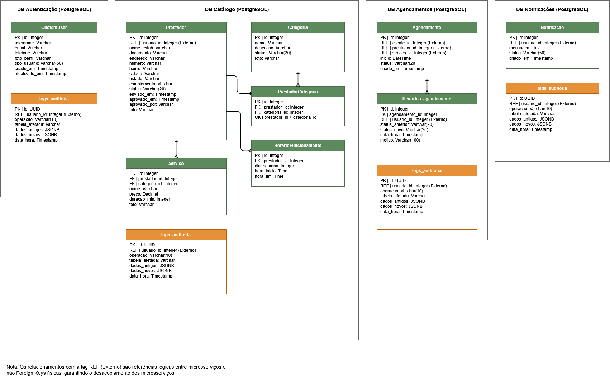

# Modelo Lógico de Dados

Modelo lógico dos quatro bancos PostgreSQL do Wonder App, um por microsserviço. Todos incluem uma tabela `logs_auditoria` alimentada por triggers nativos, atendendo o RNF004.

## DB Autenticação (PostgreSQL)

**CustomUser**: id (PK), username, email, telefone, foto_perfil, tipo_usuario, criado_em, atualizado_em.

**logs_auditoria**: id (PK UUID), usuario_id (REF externo), operacao, tabela_afetada, dados_antigos (JSONB), dados_novos (JSONB), data_hora.

## DB Catálogo (PostgreSQL)

- **Prestador**: id (PK), usuario_id (REF externo), nome_estab, documento, endereço completo, status, enviado_em, aprovado_em, aprovado_por, foto.
- **Categoria**: id (PK), nome, descricao, status, foto.
- **PrestadorCategoria**: id (PK), prestador_id (FK), categoria_id (FK), UK(prestador_id + categoria_id).
- **Servico**: id (PK), prestador_id (FK), categoria_id (FK), nome, preco, duracao_min, foto.
- **HorarioFuncionamento**: id (PK), prestador_id (FK), dia_semana, hora_inicio, hora_fim.
- **logs_auditoria**: mesmo padrão do DB Autenticação.

## DB Agendamentos (PostgreSQL)

- **Agendamento**: id (PK), cliente_id (REF externo), prestador_id (REF externo), servico_id (REF externo), inicio, status, criado_em.
- **Historico_agendamento**: id (PK), agendamento_id (FK), usuario_id (REF externo), status_anterior, status_novo, data_hora, motivo.
- **logs_auditoria**: mesmo padrão dos demais bancos.

## DB Notificações (PostgreSQL)

- **Notificacao**: id (PK), usuario_id (REF externo), mensagem, status, criado_em.
- **logs_auditoria**: mesmo padrão dos demais bancos.

## Nota de isolamento

Os relacionamentos marcados como **REF (Externo)** são referências lógicas entre microsserviços, e não Foreign Keys físicas — isso garante o desacoplamento dos microsserviços: cada banco pode evoluir, escalar ou até trocar de tecnologia sem quebrar os demais.

## Verificado em código

O script `scripts/maintenance.sh` mapeia exatamente essas tabelas por banco para rotinas de manutenção (Vacuum/Reindex). No commit [`e687be7`](https://github.com/llwkascarvalho/wonder-app/commit/e687be722e6108a73bc554175631172b95c01768), o mapeamento do `db_catalogo` foi corrigido para `categoria prestador prestador_categoria servico horariofuncionamento avaliacao logs_auditoria` — incluindo a tabela associativa `prestador_categoria`, que já constava neste modelo lógico.

Para a versão orientada a objetos deste mesmo modelo, veja [Diagrama de Classes](Diagrama-de-Classes).
