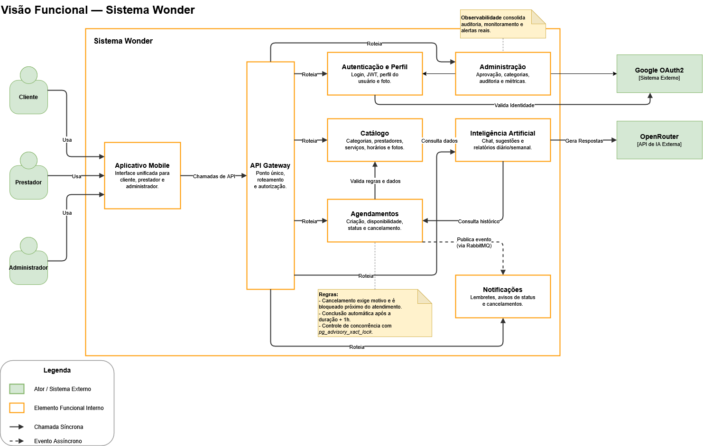

# Visão Funcional

A Visão Funcional descreve os elementos que entregam a funcionalidade do sistema Wonder: seus elementos internos, interfaces, relacionamentos e as entidades externas com que ele interage. Segue o ponto de vista Funcional de Rozanski & Woods — é a visão de referência para todos os stakeholders.

## Atores e entidades externas

| Ator/Sistema | Papel |
|---|---|
| Cliente | Busca prestadores, agenda e cancela serviços, consulta IA e notificações |
| Prestador | Gerencia vitrine, serviços, horários e agenda |
| Administrador | Aprova prestadores, gerencia categorias, consulta observabilidade |
| Google OAuth2 | Autenticação delegada (login/cadastro) |
| OpenRouter | API externa de IA (chat, sugestões, relatórios) |

## Elementos funcionais internos

- **Aplicativo Mobile** — interface unificada para cliente, prestador e administrador.
- **API Gateway** — ponto único de entrada; roteamento e autorização das chamadas.
- **Autenticação e Perfil** — login, emissão/validação de JWT, perfil e foto do usuário.
- **Catálogo** — categorias, prestadores, serviços, horários e fotos.
- **Agendamentos** — criação, disponibilidade, status e cancelamento.
- **Inteligência Artificial** — chat, sugestões e relatórios diário/semanal, com dados reais de agendamentos e catálogo.
- **Notificações** — lembretes, avisos de status e cancelamentos.
- **Administração** — aprovação de prestadores, gestão de categorias, auditoria e métricas; consolida a observabilidade do sistema.

## Fluxos principais

- O Gateway roteia as chamadas síncronas do app mobile para cada elemento funcional interno.
- **Agendamentos** valida regras junto ao **Catálogo** antes de confirmar um horário.
- **Agendamentos** publica evento assíncrono no RabbitMQ ao criar/cancelar um agendamento; **Notificações** consome esse evento.
- **Inteligência Artificial** consulta o histórico de **Agendamentos** para montar relatórios operacionais, e chama a API externa **OpenRouter** para gerar as respostas.
- **Autenticação e Perfil** valida identidade junto ao **Google OAuth2**.
- **Administração** troca dados com **Autenticação e Perfil** para consolidar observabilidade (auditoria, monitoramento e alertas).

## Regras de negócio destacadas

- Cancelamento de agendamento **exige motivo** e é **bloqueado** quando o horário está próximo do atendimento (limite: 15 minutos antes, confirmado em código).
- Conclusão automática do agendamento ocorre **duração do serviço + 1 hora** após o início (confirmado em código: 60 minutos após o fim previsto).
- Controle de concorrência de horários usa `pg_advisory_xact_lock` no PostgreSQL, evitando que dois clientes reservem o mesmo horário com o mesmo prestador (atende RF003).

## Nota de atualização (verificada em código)

O commit [`e687be7`](https://github.com/llwkascarvalho/wonder-app/commit/e687be722e6108a73bc554175631172b95c01768) introduziu uma chamada do serviço de **Inteligência Artificial** diretamente ao **Catálogo** (`CATALOGO_SERVICE_URL`), usada para resolver a duração dos serviços ao montar relatórios/sugestões. Essa dependência ainda não está desenhada nesta visão — recomenda-se adicionar uma seta "Consulta dados" de Inteligência Artificial para Catálogo na próxima revisão do diagrama.

## Boas práticas seguidas nesta visão

- Infraestrutura (RabbitMQ, banco de dados) não é modelada como elemento funcional — aparece apenas como rótulo de evento ou fora do sistema, conforme recomendado pelo ponto de vista Funcional.
- Não há elemento "Deus": as responsabilidades estão distribuídas entre os oito elementos funcionais, sem um nó central concentrando todas as interações.
- Componentes nomeados como substantivos (não verbos), com responsabilidade única e interface clara.

## Rastreabilidade com requisitos

| Elemento funcional | Requisitos atendidos |
|---|---|
| Autenticação e Perfil | RF001 |
| Catálogo | RF002, RF007, RF008, RF009 |
| Agendamentos | RF003, RF005, RF010 |
| Inteligência Artificial | RF004 |
| Notificações | RF006 |
| Administração | RF011, RF012 |

Para o detalhamento técnico de cada elemento em nível de container/serviço, veja [C4 — Container](C4-Container) e [C4 — Componentes](C4-Componentes).
