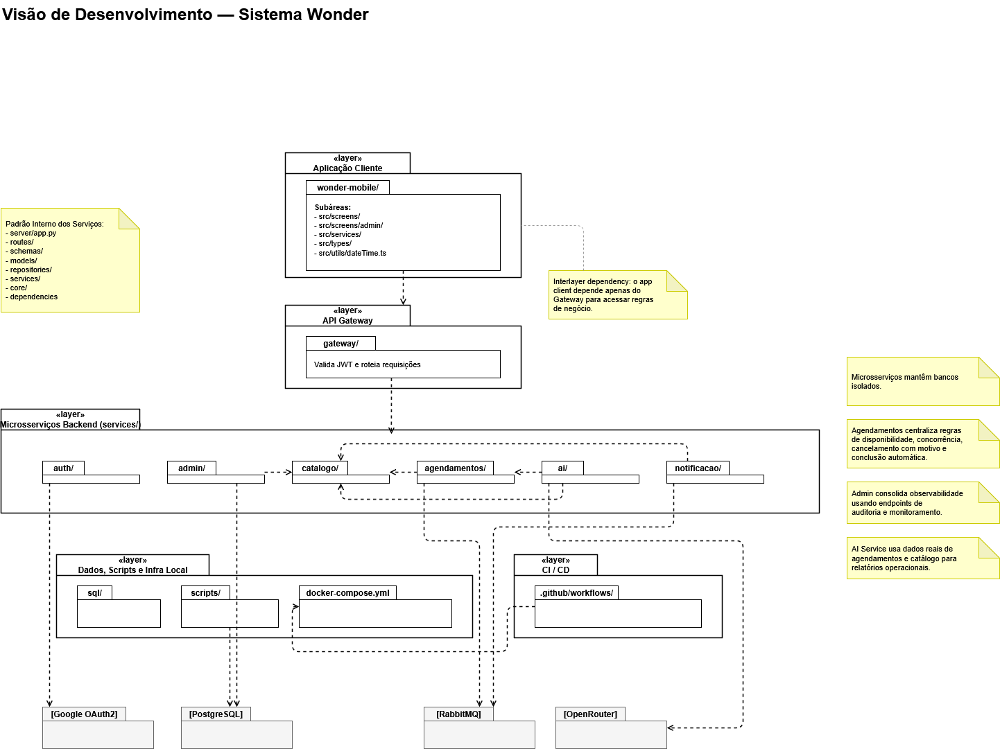

# Visão de Desenvolvimento

A Visão de Desenvolvimento descreve como o código-fonte do Wonder App está organizado para dar suporte à construção, ao build e aos testes do sistema — módulos, camadas, convenções e dependências entre eles. É voltada principalmente para desenvolvedores e testadores.



## Camadas

1. **Aplicação Cliente** (`wonder-mobile/`) — app React Native + Expo, único cliente para os três perfis de usuário.
2. **API Gateway** (`gateway/`) — valida JWT e roteia requisições para os microsserviços.
3. **Microsserviços Backend** (`services/`) — seis serviços independentes: `auth/`, `admin/`, `catalogo/`, `agendamentos/`, `ai/`, `notificacao/`.
4. **Dados, Scripts e Infra Local** — `sql/`, `scripts/`, `docker-compose.yml`.
5. **CI/CD** — `.github/workflows/`.

## Regra de dependência entre camadas

O app cliente depende **apenas** do Gateway para acessar regras de negócio — nunca chama um microsserviço diretamente. Essa regra está refletida no C4 Container (Wonder Mobile → API Gateway → serviços).

## Estrutura interna de `wonder-mobile/`

```
src/
├── screens/
│   └── admin/        # telas exclusivas do administrador
├── services/
├── types/
└── utils/dateTime.ts
```

Confirmado em código: o commit `e687be7` adicionou as telas `AdminAuditScreen.tsx`, `AdminHomeScreen.tsx`, `AdminMonitoringScreen.tsx`, `AdminProviderDetailsScreen.tsx`, `AdminProvidersScreen.tsx` e `AdminTabs.tsx` exatamente dentro de `src/screens/admin/`, junto com `AppointmentsScreen.tsx`, `LoginScreen.tsx`, `NotificationsScreen.tsx` e `ProviderAgendaScreen.tsx` em `src/screens/`.

## Padrão interno dos microsserviços

Cada serviço em `services/<nome>/src/main/` segue a mesma convenção:

```
routes/          # endpoints FastAPI
schemas/         # validação Pydantic
models/          # ORM (SQLAlchemy)
repositories/    # acesso a dados e regras de persistência
services/        # regras de negócio
core/             # configuração
dependencies/
```

## Notas por serviço

- **Microsserviços mantêm bancos isolados** — cada serviço só acessa seu próprio banco PostgreSQL; referências entre serviços são lógicas (por ID), nunca FK física.
- **Agendamentos** centraliza regras de disponibilidade, concorrência, cancelamento com motivo e conclusão automática.
- **Admin** consolida observabilidade usando endpoints de auditoria e monitoramento dos demais serviços — não mantém banco próprio.
- **AI Service** usa dados reais de agendamentos e catálogo para relatórios operacionais.

## Dependências externas por camada

| Camada/serviço | Dependência externa |
|---|---|
| Auth | Google OAuth2 |
| Dados/Infra local | PostgreSQL (4 bancos) |
| Agendamentos, Notificações, Admin | RabbitMQ |
| AI | OpenRouter |

## Atualização confirmada em código

O commit [`e687be7`](https://github.com/llwkascarvalho/wonder-app/commit/e687be722e6108a73bc554175631172b95c01768) adicionou `CATALOGO_SERVICE_URL` em `services/ai/src/main/core/config.py`, e `services/agendamentos/src/main/repositories/agendamento_repo.py` passou a chamar o Catálogo Service via HTTP (`buscar_duracao_servico`) para resolver a duração de um serviço ao decidir a conclusão automática de um agendamento. Recomenda-se adicionar essas duas chamadas HTTP inter-serviço ao diagrama na próxima revisão.

O mesmo commit também ajustou `scripts/maintenance.sh`: o mapeamento de tabelas do `db_catalogo` passou a incluir `prestador_categoria` no lugar de `fotoestabelecimento`, alinhando o script de manutenção com o schema real descrito no [Modelo Lógico](Modelo-Logico).

Para o detalhamento de cada serviço em nível de componente interno, veja [C4 — Componentes](C4-Componentes).
